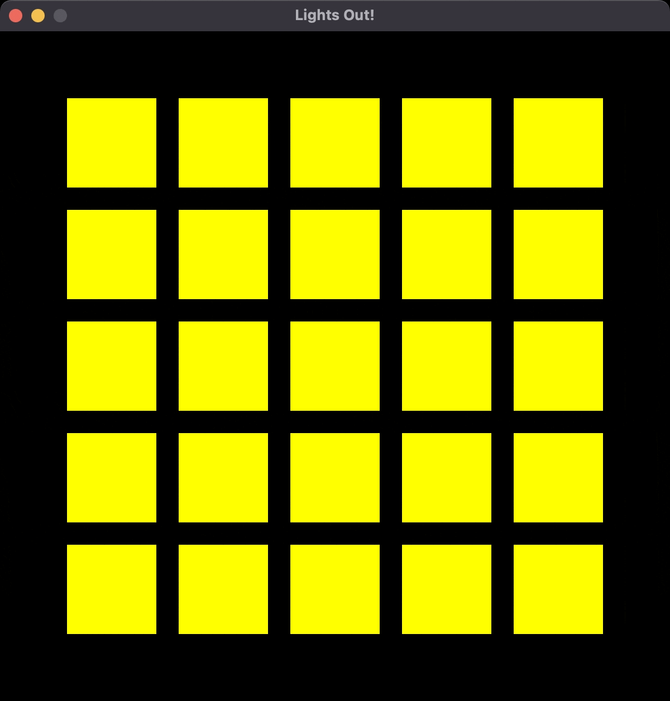
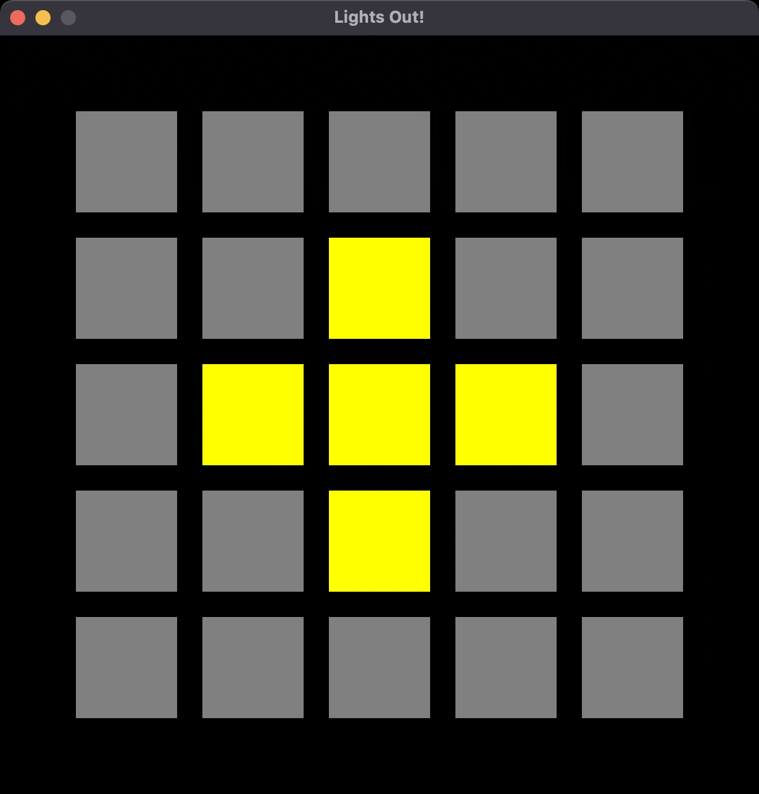

# CS 2300 Module 4 Applied Project: Lights Out

For this project, you will create a C++ graphics program that allows the user to play the game Lights Out.

## Requirements
You can work in a team of 2-4 people for this project.

* Create a **private** GitHub repository in the course organization.
  * **Your repository must be named with the convention: Lights-Out-netid1-netid2[-netid3-netid4]**, where netid is your UVM NetID username.
  * Have one team member create the repository and add the other members as collaborators (on GitHub, go to Settings -> Collaborators and Teams, then add the others' GitHub usernames).

## Lights Out
Lights Out was a handheld game in the days of Lisa's childhood. You can play it online here: [https://www.logicgamesonline.com/lightsout/](https://www.logicgamesonline.com/lightsout/).

### Base Game
In its simplest form, the 5x5 grid of lights begins with all of the lights lit. When you click on one of the lights, it toggles itself and the (up to) four lights it borders.

Here's a gif of the beginning of the game, where the lights have a red outline hover effect: 

When you make all the lights go off, you win the game and can no longer click on the lights:

For testing purposes, here are the lights you need to click to get from a fully lit start to a fully unlit end:

| | | |*|*|
|-|-|-|-|-|
|*|*| |*|*|
|*|*|*| | |
| |*|*|*| |
|*| |*|*| |

### Added features
You can add more features to the base game:
* Start with a random configuration, instead of all of the lights on. Hint: not all random sequences are solvable, so be careful to make sure it can be won!
* Include a start screen with the directions written in text
* Keep track of the number of lights the user clicks and display it on the screen at all times
* Record the amount of time it takes the user to finish the game and print it on the end screen

## Grading
The project is out of 50 points.

| Points Possible | Description of requirement        |
|-----------------|-----------------------------------|
| 30 pts          | Base game to match the given gifs |
| 5 pts each      | Added features listed above       |

It is expected that your program will compile, run, and have good style. If your project does not, you may receive point deductions.
